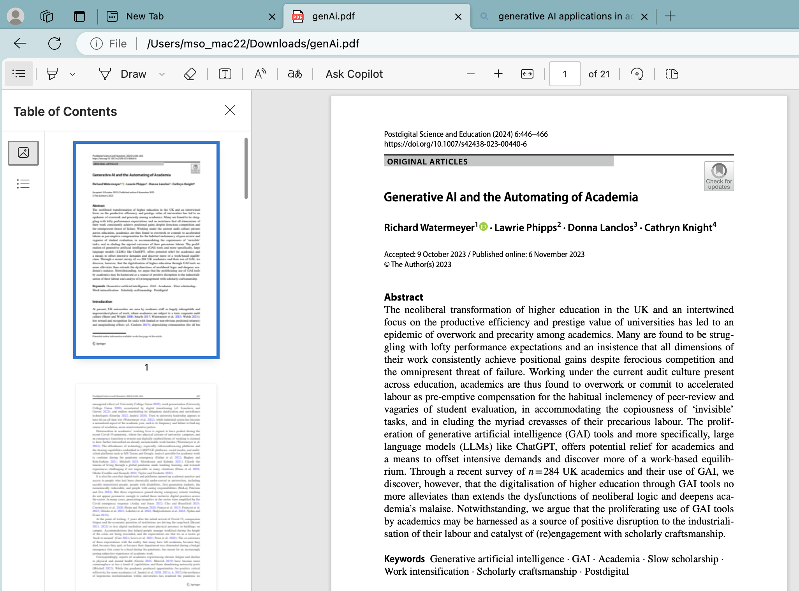
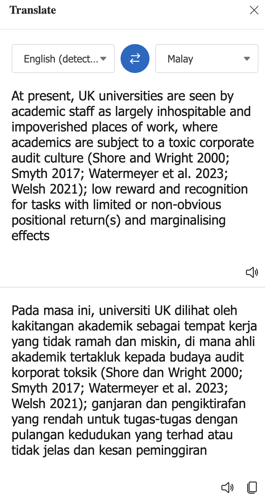
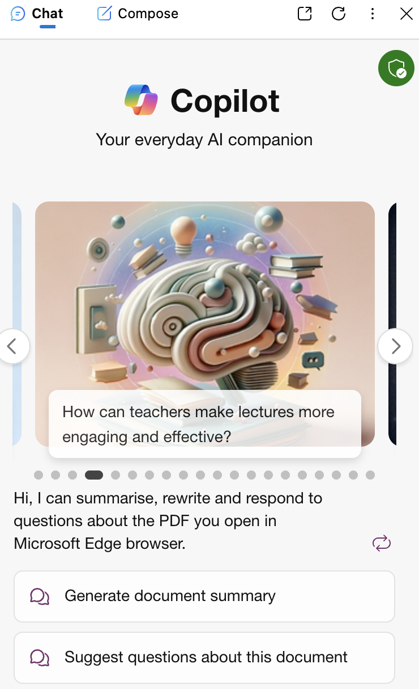
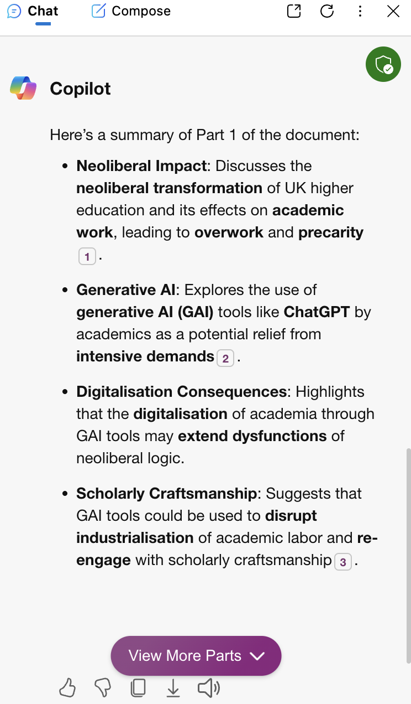

# Document Analysis: Copilot

## 1. Download the document
You need to download the document to enable the document analysis process to be carried out. The document is
| No | Document Name |
|--------:|---------|
| 1. | [Generative AI and the Automating of Academia](https://github.com/drshahizan/ai-tools/blob/main/images/genAi.pdf) |
| 2. | [Slaid amanat TNCAA 2024](https://github.com/drshahizan/ai-tools/blob/main/images/SLIDE-AMANAT-TNCAA-2024.pdf) |
| 3. | [🖼️ Risk Management](https://github.com/drshahizan/ai-tools/blob/main/images/risk.png) |

## 2. How to open a file in Microsoft Edge
To open a PDF document named "SLIDE-AMANAT-TNCAA-2024.pdf" in Microsoft Edge, please follow these steps:
1. Please download the document. After that, **find the PDF document** you want to open on your computer.
2. **Right-click** on the document and choose **'Open With'**, then select **Microsoft Edge** from the list of applications.
3. If the document is already open in another web browser, you can **drag and drop** the PDF file into the Microsoft Edge window to open it. The diagram below shows the PDF file successfully opened in Microsoft Edge.

Once the document is open in Microsoft Edge, you can use the toolbar at the top of the screen to navigate the document, change the display size, and search for specific text. Microsoft Edge also provides functions to edit, save, or print the PDF document.

## 3. Functions available for document analysis

PDF document analysis in Microsoft Edge can be performed using the available functions such as:

1. **Opening PDF**: You can easily open PDF documents in Microsoft Edge by simply double-clicking on the file or dragging and dropping the file into the Edge browser window.

2. **Editing PDF**: Microsoft Edge allows you to fill in blank fields in a PDF or add new text. You can select 'Edit' from the toolbar to start editing and save the edited PDF by selecting 'Save'.

3. **Adding Notes**: You can also add new text, images, and shapes to the PDF by selecting 'Add notes' from the top toolbar. This is suitable for highlighting important information or annotating the document.

4. **Printing PDF**: To print a PDF document from Microsoft Edge, open the PDF and select 'Print' from the toolbar. Then choose the printer and the desired print options, and select 'Print' to start printing.

5. **Saving PDF**: After making edits and printing a paper copy, you might want to save your PDF. Open the PDF in Edge, select 'Save', determine the storage location, name the file, and save.

6. **Translating PDF**: Microsoft Edge allows you to translate text from a PDF document into another language. Select the text you want to translate, then click the translate icon in the PDF toolbar.

8. **Using Copilot for Analysis**: You can use Copilot to analyze PDF documents by opening the document in Edge, clicking on the Copilot icon, and typing 'summarize this' to get a summary of the document.

  

You can also click on 'Suggest questions about this document', and the results would be as follows:
1. **Generative AI Impact**: How does the proliferation of generative AI tools affect the workload and academic practices of UK academics?
2. **Neoliberal Influence**: In what ways has the neoliberal transformation of higher education contributed to the current state of academia in the UK?
3. **Digital Tools**: What role do digital tools and platforms play in shaping the inclusivity and accessibility of academic practice during the Covid-19 pandemic?
4. **Work Intensification**: Can generative AI tools potentially exacerbate the work intensification experienced by academics, and if so, how?

## Contribution 🛠️
Please create an [Issue](https://github.com/drshahizan/ai-tools/issues) for any improvements, suggestions or errors in the content.

You can also contact me using [Linkedin](https://www.linkedin.com/in/drshahizan/) for any other queries or feedback.

