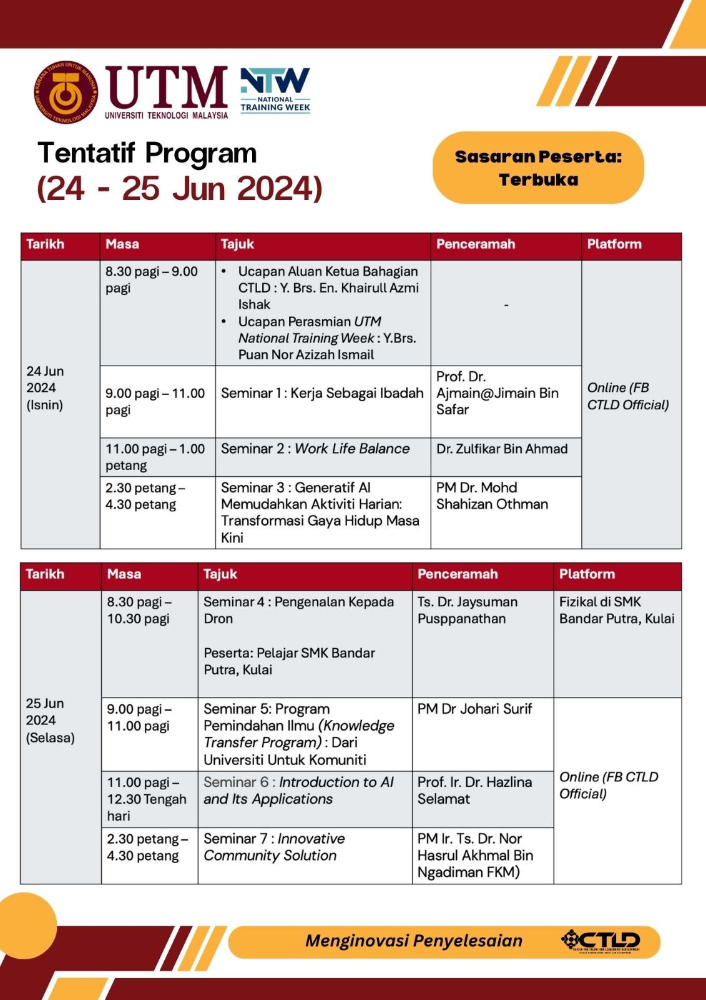

  
  

# Seminar 3: Generatif AI Memudahkan Aktiviti Harian: Transformasi Gaya Hidup Masa Kini

## Generative AI

| No | Lesson | Topic |
|--------|---------|---------|
| 1. | Article | [Generative AI Global Interest Report 2023](https://www.electronicshub.org/generative-ai-global-interest-report-2023/) |
| 2. | Installation & Login | [ChatGPT, Copilot, Gemini](pimpin/signin.md) |
| 3. | Prompt | [Effective prompts](https://drshahizan.gitbook.io/copywriting-chatgpt/prompts/effective-prompts) |
|  |  | [ChatGPT Expert Prompts](https://github.com/drshahizan/Generative-AI-Playground/blob/main/materials/prompt.md) |
|  |  | [ChatGPT Prompts For Research Papers](https://github.com/drshahizan/Generative-AI-Playground/blob/main/materials/prompt_research.md) |
|  |  | [ChatGPT Prompts for Academic Writing](https://github.com/drshahizan/Generative-AI-Playground/blob/main/materials/prompt_academic.md) |
|  |  | [215+ ChatGPT Prompts & How to Write your Own](https://writesonic.com/blog/chatgpt-prompts) |
|  |  | [AIPRM Prompt Templates](https://drshahizan.gitbook.io/copywriting-chatgpt/prompts/aiprm-prompt-templates) |
|  |  | [Chat with Copilot regarding the PDF file](https://github.com/drshahizan/Generative-AI-Playground/blob/main/materials/copilot.md) |
| 4. | Copywriting | [Role of Copywriting](https://drshahizan.gitbook.io/copywriting-chatgpt/introduction-copywriting/role) |
|  | | [Case study: ⚽ My Bola](https://drshahizan.gitbook.io/copywriting-chatgpt/introduction-copywriting/case-study/copywriting) |
| 5. | Image Generation | [Bing's Image Creator](https://github.com/drshahizan/Generative-AI-Playground/blob/main/materials/bing_image.md) |
|  |  | [Image Prompt Generator](https://aivyx.com/bing-create-prompt-generator/) |

## Demonstration

| No | Topic |
|------------|----|
| 1. | [Think Machine: Multidimensional Mind Mapping](https://thinkmachine.com/) |
| 2. | [Use of Generative AI Prompt](leader/function.md) |
| 3. | [Document Analysis using Copilot](leader/document_copilot.md) |
| 4. | [MarkMap](pimpin/markmap.md) |
| 5. | [Document Analysis using ChatGPT](pimpin/dokumen_chatgpt.md) |
| 6. | [Julius.ai](https://julius.ai/) |
| 7. | [claude.ai](https://claude.ai/)|
| 7. | [Malaysian Cultural Artistry](https://github.com/drshahizan/Generative-AI-Playground/blob/main/materials/drawing.md) |

## Others

| No | Lesson | Topic |
|--------:|---------|---------|
| 1. | AI Show Case | [Future of Work](../../images/Future%20of%20Work%20.pdf) |
|||[Stunning AI shows how it would kill 90%. w Elon Musk](https://youtu.be/J6Mdq3n6kgk?si=4G0k5-WNH55pBMhw)|
|||[Artificial Intelligence: 60 Minutes ](https://youtu.be/aZ5EsdnpLMI?si=3aEFdMyTnOWZTuCZ)|
||| [Pengenalan Kepada Artificial Intelligence (AI)](https://youtu.be/kms0WrEbs0Q?si=woVk00RDgFNC5rBd)|
| 2. | AI Apps| [askLAYLA](https://justasklayla.com/) |
||| [Penyampai Radio AI Yang Pertama Di Malaysia](https://says.com/my/seismik/kenali-aina-sabrina-dj-fly-fm-juga-ai-yang-pertama-di-malaysia-sebagai-penyampai-radio)|
|||[Sora](https://openai.com/sora)|
||| [10 Website AI Terbaik Buat Kamu Gunakan di 2024](https://www.facebook.com/reel/671923085023778) |
||| [Mudah banget buat video cerita kartun animasi 3D pakai](https://www.youtube.com/watch?v=6IYBxbpKato)|
||| [Cara Bikin Konten AI VIRAL dengan Bing Chat + CapCut](https://youtu.be/ed30BLkVpis?si=Z6XmTWxVO1PC_kyv)|
||| [10 Best AI Presentation Generators](https://www.unite.ai/best-ai-presentation-generators/)|

## Generatif AI

| No | Pelajaran | Topik |
|--------|---------|---------|
| 1.| Slaid |[Kecerdasan Buatan dan Kepimpinan Strategik](https://liveutm-my.sharepoint.com/:p:/g/personal/shahizan_live_utm_my/EaNUOHIq5bZOqvmg21dRsPYBjccq5qiHdUZxOHc70IXUxg?e=y6mqJO)
| 2.| Artikel |[Generative AI Global Interest Report 2023](https://www.electronicshub.org/generative-ai-global-interest-report-2023/)
| 3. | Pemasangan & Log masuk |[ChatGPT, Copilot, Gemini](materials/pimpin/signin.md)|
| 4. | Arahan | [Effective prompts](https://drshahizan.gitbook.io/copywriting-chatgpt/prompts/effective-prompts)|
|  |  | [ChatGPT Expert Prompts](https://github.com/drshahizan/Generative-AI-Playground/blob/main/materials/prompt.md)|
|  |  | [Latihan: Penggunaan arahan Generatif AI](materials/pimpin/fungsi.md)|
|  |  | [Latihan: Analisa dokumen menggunakan Copilot](materials/pimpin/dokumen_copilot.md)|
|  |  | [Latihan: MarkMap](materials/pimpin/markmap.md)|
|  |  | [Latihan: Analisa dokumen menggunakan ChatGPT](materials/pimpin/dokumen_chatgpt.md)|
|  |  | [Latihan: Julius.ai](https://julius.ai/)|
|  |  | [Latihan: Malaysian Cultural Artistry](https://github.com/drshahizan/Generative-AI-Playground/blob/main/materials/drawing.md) |
|  |  | [ChatGPT Prompts For Research Papers](https://github.com/drshahizan/Generative-AI-Playground/blob/main/materials/prompt_research.md)|
|  |  | [ChatGPT Prompts for Academic Writing](https://github.com/drshahizan/Generative-AI-Playground/blob/main/materials/prompt_academic.md)|
|  |  | [215+ ChatGPT Prompts & How to Write your Own](https://writesonic.com/blog/chatgpt-prompts)|
|  |  | [AIPRM Prompt Templates](https://drshahizan.gitbook.io/copywriting-chatgpt/prompts/aiprm-prompt-templates)|
|  |  | [Chat with Copilot regarding the PDF file](https://github.com/drshahizan/Generative-AI-Playground/blob/main/materials/copilot.md)|
| 5. | Copywriting| [Role of Copywriting](https://drshahizan.gitbook.io/copywriting-chatgpt/introduction-copywriting/role) |
|  | | [Case study: ⚽ My Bola](https://drshahizan.gitbook.io/copywriting-chatgpt/introduction-copywriting/case-study/copywriting) |
| 6. | Penjanaan imej | [Bing's Image Creator](https://github.com/drshahizan/Generative-AI-Playground/blob/main/materials/bing_image.md) |
|  |  | [Image Prompt Generator](https://aivyx.com/bing-create-prompt-generator/) |

## Maklumat Tambahan

| No | Pelajaran | Topik |
|--------:|---------|---------|
| 1. | AI Show Case | [Future of Work](../../images/Future%20of%20Work%20.pdf) |
|||[Stunning AI shows how it would kill 90%. w Elon Musk](https://youtu.be/J6Mdq3n6kgk?si=4G0k5-WNH55pBMhw)|
|||[Artificial Intelligence: 60 Minutes ](https://youtu.be/aZ5EsdnpLMI?si=3aEFdMyTnOWZTuCZ)|
||| [Pengenalan Kepada Artificial Intelligence (AI)](https://youtu.be/kms0WrEbs0Q?si=woVk00RDgFNC5rBd)|
| 2. | AI Apps| [askLAYLA](https://justasklayla.com/) |
|||[Trip Planner AI](https://tripplanner.ai/)|
||| [Penyampai Radio AI Yang Pertama Di Malaysia](https://says.com/my/seismik/kenali-aina-sabrina-dj-fly-fm-juga-ai-yang-pertama-di-malaysia-sebagai-penyampai-radio)|
|||[Sora](https://openai.com/sora)|
||| [10 Website AI Terbaik Buat Kamu Gunakan di 2024](https://www.facebook.com/reel/671923085023778) |
||| [Mudah banget buat video cerita kartun animasi 3D pakai](https://www.youtube.com/watch?v=6IYBxbpKato)|
||| [Cara Bikin Konten AI VIRAL dengan Bing Chat + CapCut](https://youtu.be/ed30BLkVpis?si=Z6XmTWxVO1PC_kyv)|
||| [10 Best AI Presentation Generators](https://www.unite.ai/best-ai-presentation-generators/)|

## Contribution 🛠️
Please create an [Issue](https://github.com/drshahizan/ai-tools/issues) for any improvements, suggestions or errors in the content.

You can also contact me using [Linkedin](https://www.linkedin.com/in/drshahizan/) for any other queries or feedback.

