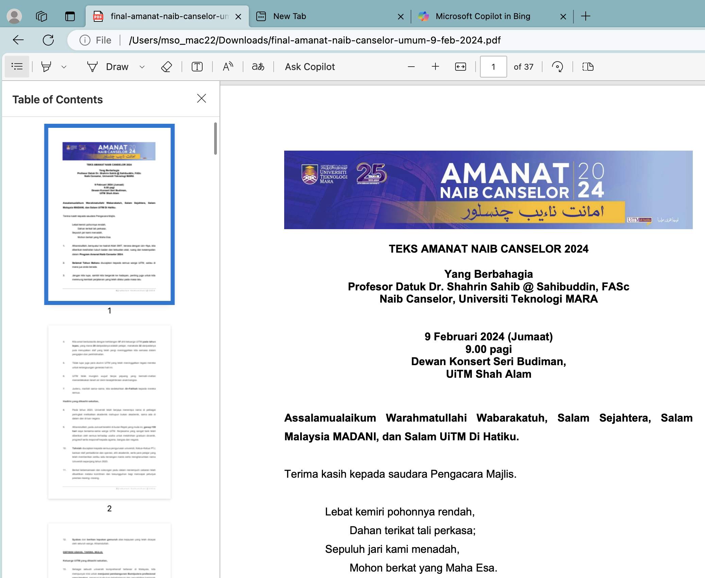
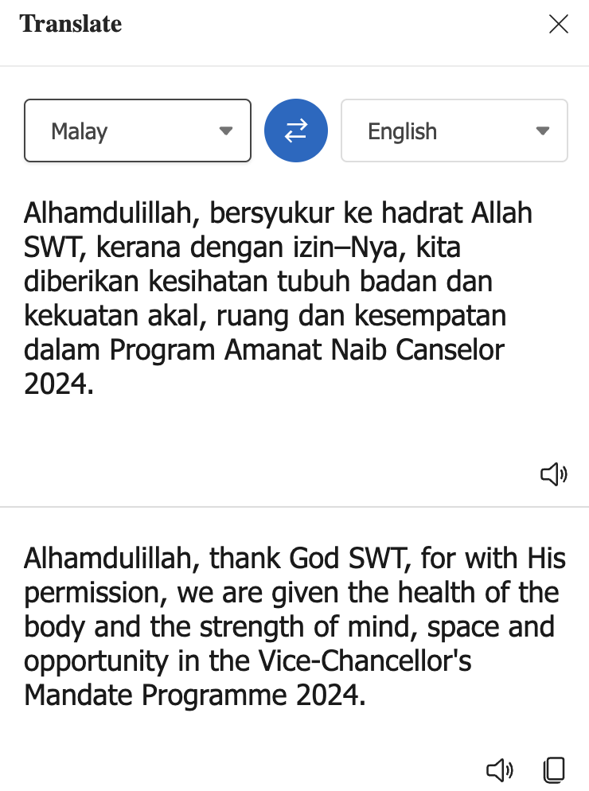
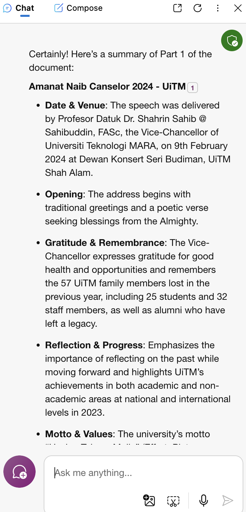

# Analisis Dokumen: Copilot

## 1. Muat turun dokumen
Anda perlu memuat turun dokumen untuk membolehkan proses anlisis dokumen dilaksanakan. Dokumen tersebut ialah
| No  | Nama dokumen |
|--------:|---------|
| 1. | [Teks Amanat Naib Canselor 2024](https://www.uitm.edu.my/images/document/amanat-vc/final-amanat-naib-canselor-umum-9-feb-2024.pdf) |
| 2. | [Slaid Amanat Naib Canselor 2024](https://uitm.edu.my/images/document/amanat-vc/slide_amanat-nc-2024.pdf) |
| 3. | [Laporan Tahunan UiTM 2021](https://www.uitm.edu.my/images/stories/about/LaporanTahunanUiTM2021.pdf) |

## 2. Cara untuk membuka fail di Microsoft Edge
Untuk membuka dokumen PDF yang bernama "final-amanat-naib-canselor-umum-9-feb-2024.pdf" di Microsoft Edge, sila ikuti langkah-langkah ini:
1. Sila muat turun dokumen tersebut. Setelah itu **Cari dokumen PDF** yang ingin anda buka di komputer anda.
2. **Klik kanan** pada dokumen tersebut dan pilih **'Open With'**, kemudian pilih **Microsoft Edge** dari senarai aplikasi.
3. Jika dokumen tersebut sudah terbuka di pelayar web lain, Anda boleh **menyeret dan menjatuhkan** fail PDF tersebut ke dalam tetingkap Microsoft Edge untuk membukanya. Rajah di bawah menunjukkan fail PDF yang berjaya di buka di Microsoft Edge.

Setelah dokumen terbuka di Microsoft Edge, anda dapat menggunakan bar alat yang terdapat di bahagian atas skrin untuk menavigasi dokumen, mengubah ukuran tampilan, dan mencari teks tertentu. Microsoft Edge juga menyediakan fungsi untuk mengedit, menyimpan, atau mencetak dokumen PDF tersebut.

## 3. Fungsi yang tersedia untuk analisis dokumen

Analisis dokumen PDF di Microsoft Edge boleh dilakukan dengan menggunakan fungsi yang tersedia seperti:

1. **Membuka PDF**: Anda boleh membuka dokumen PDF dengan mudah di Microsoft Edge dengan hanya mengklik dua kali pada fail atau menyeret dan menjatuhkan fail ke dalam tetingkap pelayar Edge.

2. **Mengedit PDF**: Microsoft Edge membolehkan anda mengisi medan kosong pada PDF atau menambah teks baru. Anda boleh memilih 'Edit' dari bar alat untuk memulakan pengeditan dan menyimpan PDF yang telah diedit dengan memilih 'Save'.

3. **Menambah Nota**: Anda juga boleh menambah teks, imej, dan bentuk baru ke dalam PDF dengan memilih 'Add notes' di bar alat atas. Ini sesuai untuk menonjolkan maklumat penting atau membuat anotasi pada dokumen.

4. **Mencetak PDF**: Untuk mencetak dokumen PDF dari Microsoft Edge, buka PDF tersebut dan pilih 'Print' dari bar alat. Kemudian pilih pencetak dan opsyen cetak yang dikehendaki, dan pilih 'Print' untuk memulakan pencetakan.

5. **Menyimpan PDF**: Selepas membuat suntingan dan mencetak salinan kertas, anda mungkin ingin menyimpan PDF anda. Buka PDF di Edge, pilih 'Save', tentukan lokasi penyimpanan, beri nama fail, dan simpan.

6. **Terjemahan PDF**: Microsoft Edge membolehkan anda menterjemahkan teks dari dokumen PDF ke bahasa lain. Pilih teks yang ingin diterjemahkan, kemudian klik ikon terjemah di bar alat PDF.

8. **Menggunakan Bing AI untuk Analisis**: Anda boleh menggunakan Bing AI untuk menganalisis dokumen PDF dengan membuka dokumen di Edge, klik ikon Bing AI, dan ketik 'summarize this' untuk mendapatkan ringkasan dokumen.

  

Anda juga boleh klik pada 'Suggest questions about this document', hasilnya adalah seperti berikut:
1. What are the key achievements of Universiti Teknologi MARA (UiTM) in 2023?
2. How does the 'Globally Renowned, Locally Rooted' theme reflect UiTM's vision for 2025?
3. What are the main objectives of the UiTM2025 Transformation Macro Phase?
4. How has UiTM performed in various global university rankings in 2024?
5. What is the significance of the 9R Principles in maintaining UiTM's identity?
6. How does UiTM plan to enhance the employability of its graduates globally?
7. What strategies are in place for talent development among UiTM's academic and administrative staff?]
8. What initiatives are being taken to address mental health issues among UiTM students?
9. How does UiTM intend to integrate the 'Quintuple Helix' approach in its community and industry engagement?
10. What are the Vice-Chancellor's strategic emphases for UiTM in 2024?

## Latihan
#### Sila taipkan arahan berikut
   1. Huraikan halatuju UiTM
   2. Hasilkan analisis SWOT

#### Berdasarkan konteks dokumen yang diberikan, sila dapatkan jawapan untuk 10 soalan yang berkaitan dengan Amanat Naib Canselor 2024 di Universiti Teknologi MARA:
1. Apakah tujuan utama yang disampaikan dalam Amanat Naib Canselor 2024?
2. Bagaimana prestasi Universiti Teknologi MARA dalam QS World University Rankings 2024 dan apakah peningkatan yang dicapai?
3. Apakah prinsip 9R yang ditekankan oleh Naib Canselor dan bagaimana prinsip ini mempengaruhi hala tuju universiti?
4. Bagaimana UiTM menyokong pembangunan Bumiputera profesional melalui kurikulum dan penyelidikan?
5. Apakah inisiatif yang diperkenalkan oleh Naib Canselor UiTM ke-6 untuk mencapai visi 'Globally Renowned University'?
6. Bagaimana UiTM mengatasi cabaran globalisasi dan perubahan landskap ekonomi serta teknologi?
7. Apakah strategi UiTM untuk meningkatkan kebolehpasaran graduan dan bersaing di peringkat global?
8. Bagaimana UiTM merancang untuk memperkasakan hubungan dengan Raja-Raja Melayu dan memahami Perkara 153 Perlembagaan Persekutuan?
9. Apakah langkah-langkah yang diambil UiTM untuk memperbaiki kesihatan mental di kalangan staf dan pelajar?
10. Bagaimana UiTM merancang untuk mempertahankan dan mengembangkan bakat dalam kalangan pensyarah dan pentadbir?

## Contribution 🛠️
Please create an [Issue](https://github.com/drshahizan/ai-tools/issues) for any improvements, suggestions or errors in the content.

You can also contact me using [Linkedin](https://www.linkedin.com/in/drshahizan/) for any other queries or feedback.

