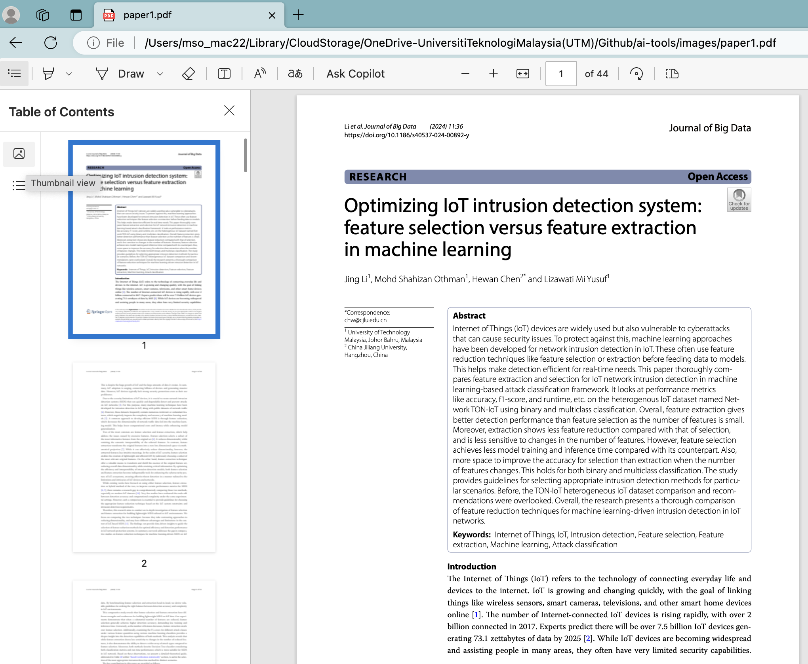
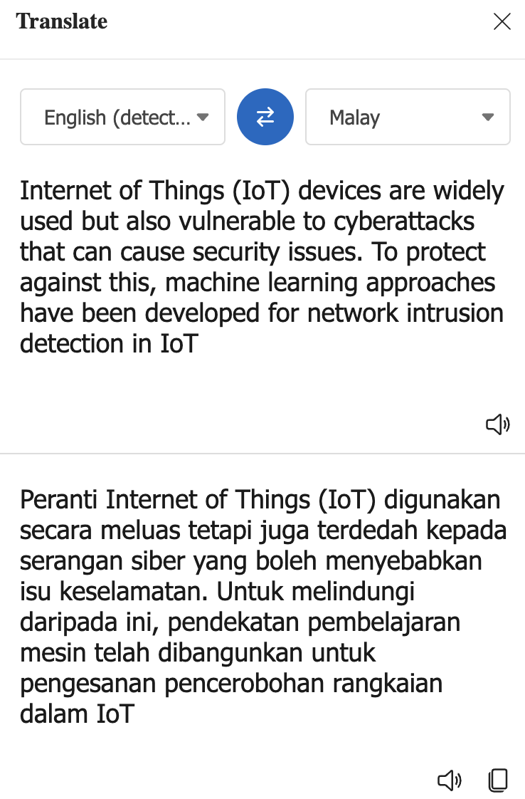
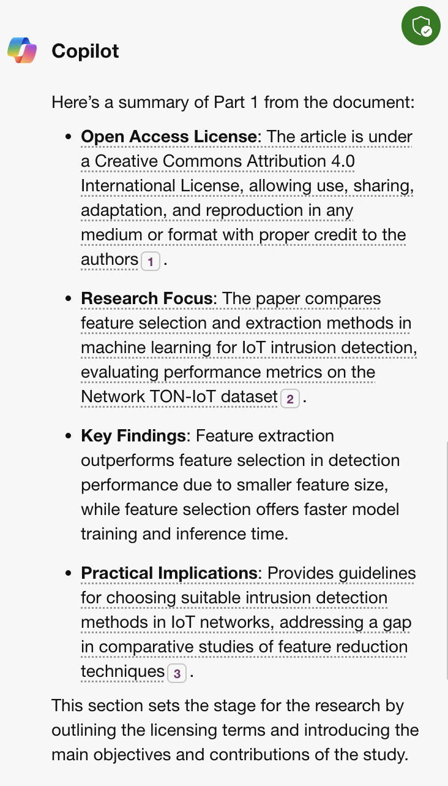

# Analisis Dokumen: Copilot

## 1. Muat turun dokumen
Anda perlu memuat turun dokumen untuk membolehkan proses anlisis dokumen dilaksanakan. Dokumen tersebut ialah

[Li, J., **Othman, M. S.**, Chen, H., & Yusuf, L. M. (2024). Optimizing IoT intrusion detection system: feature selection versus feature extraction in machine learning. *Journal of Big Data, 11*, Article 36. https://doi.org/10.1186/s40537-024-00892-y](../../images/paper1.pdf)
   
## 2. Cara untuk membuka fail di Microsoft Edge
Untuk membuka dokumen PDF yang bernama "paper1.pdf" di Microsoft Edge, sila ikuti langkah-langkah ini:
1. Sila muat turun dokumen tersebut. Setelah itu **Cari dokumen PDF** yang ingin anda buka di komputer anda.
2. **Klik kanan** pada dokumen tersebut dan pilih **'Open With'**, kemudian pilih **Microsoft Edge** dari senarai aplikasi.
3. Jika dokumen tersebut sudah terbuka di pelayar web lain, Anda boleh **menyeret dan menjatuhkan** fail PDF tersebut ke dalam tetingkap Microsoft Edge untuk membukanya. Rajah di bawah menunjukkan fail PDF yang berjaya di buka di Microsoft Edge.

Setelah dokumen terbuka di Microsoft Edge, anda dapat menggunakan bar alat yang terdapat di bahagian atas skrin untuk menavigasi dokumen, mengubah ukuran tampilan, dan mencari teks tertentu. Microsoft Edge juga menyediakan fungsi untuk mengedit, menyimpan, atau mencetak dokumen PDF tersebut.

## 3. Fungsi yang tersedia untuk analisis dokumen

Analisis dokumen PDF di Microsoft Edge boleh dilakukan dengan menggunakan fungsi yang tersedia seperti:

1. **Membuka PDF**: Anda boleh membuka dokumen PDF dengan mudah di Microsoft Edge dengan hanya mengklik dua kali pada fail atau menyeret dan menjatuhkan fail ke dalam tetingkap pelayar Edge.

2. **Mengedit PDF**: Microsoft Edge membolehkan anda mengisi medan kosong pada PDF atau menambah teks baru. Anda boleh memilih 'Edit' dari bar alat untuk memulakan pengeditan dan menyimpan PDF yang telah diedit dengan memilih 'Save'.

3. **Menambah Nota**: Anda juga boleh menambah teks, imej, dan bentuk baru ke dalam PDF dengan memilih 'Add notes' di bar alat atas. Ini sesuai untuk menonjolkan maklumat penting atau membuat anotasi pada dokumen.

4. **Mencetak PDF**: Untuk mencetak dokumen PDF dari Microsoft Edge, buka PDF tersebut dan pilih 'Print' dari bar alat. Kemudian pilih pencetak dan opsyen cetak yang dikehendaki, dan pilih 'Print' untuk memulakan pencetakan.

5. **Menyimpan PDF**: Selepas membuat suntingan dan mencetak salinan kertas, anda mungkin ingin menyimpan PDF anda. Buka PDF di Edge, pilih 'Save', tentukan lokasi penyimpanan, beri nama fail, dan simpan.

6. **Terjemahan PDF**: Microsoft Edge membolehkan anda menterjemahkan teks dari dokumen PDF ke bahasa lain. Pilih teks yang ingin diterjemahkan, kemudian klik ikon terjemah di bar alat PDF.

8. **Menggunakan Bing AI untuk Analisis**: Anda boleh menggunakan Bing AI untuk menganalisis dokumen PDF dengan membuka dokumen di Edge, klik ikon Bing AI, dan klik 'summarize this' untuk mendapatkan ringkasan dokumen.

  

Anda juga boleh klik pada 'Suggest questions about this document', hasilnya adalah seperti berikut:

1. **IoT Security**: How do feature selection and feature extraction methods compare in terms of improving IoT intrusion detection systems?
2. **Machine Learning Techniques**: What are the advantages and disadvantages of using machine learning for network intrusion detection in IoT?
3. **Dataset Analysis**: Can you explain the significance of the TON-IoT dataset used in the study for IoT security research?
4. **Performance Metrics**: What performance metrics were used to evaluate the intrusion detection models, and why are they important?

## Contribution 🛠️
Please create an [Issue](https://github.com/drshahizan/ai-tools/issues) for any improvements, suggestions or errors in the content.

You can also contact me using [Linkedin](https://www.linkedin.com/in/drshahizan/) for any other queries or feedback.

