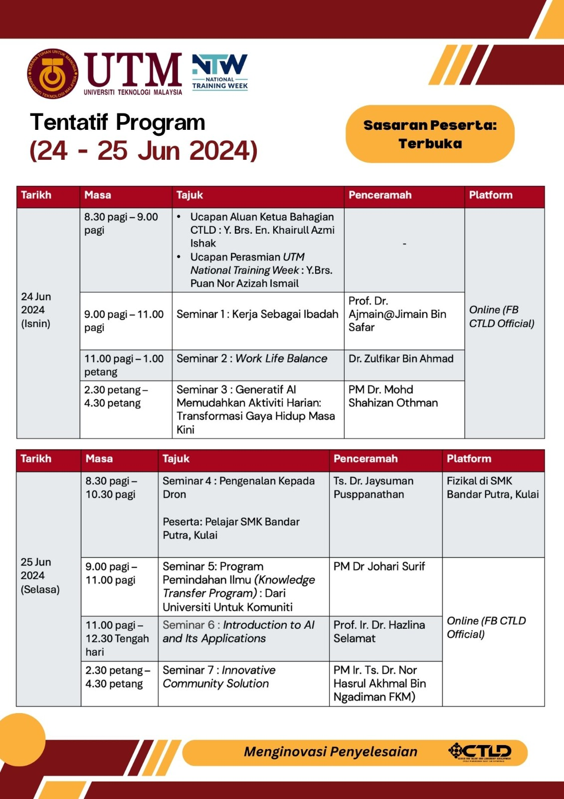

c<a href="https://github.com/drshahizan/ai-tools/stargazers"></a>
<a href="https://github.com/drshahizan/ai-tools/network/members"></a>
<a href="https://github.com/drshahizan/ai-tools"></a>
<a href="https://github.com/drshahizan/ai-tools/issues"></a>
<a href="https://github.com/drshahizan/ai-tools/graphs/contributors"></a>


# Analisis Imej: ChatGPT

## 1. Muat turun jadual UNTW
Anda perlu memuat turun imej untuk membolehkan proses anlisis dokumen dilaksanakan. Dokumen tersebut ialah

<p align="center">
  
</p>

## 2. Muat naik fail

1. Sila muat naik fail jadualNTW.jpeg di kotak input chatgpt dan masukkan arahan 'huraikan'. 

2. Hasil perlaksanaan adalah:

```
Tentatif program untuk UTM National Training Week yang akan diadakan pada 24 hingga 25 Jun 2024 mengandungi pelbagai seminar menarik yang disasarkan untuk peserta terbuka. Program dimulakan pada 24 Jun 2024 dengan ucapan aluan oleh Ketua Bahagian CTLD, Y. Brs. En. Khairull Azmi Ishak, dan ucapan perasmian oleh Y. Brs. Puan Nor Azizah Ismail. Seterusnya, terdapat tiga seminar pada hari tersebut: 

1. Seminar 1: "Kerja Sebagai Ibadah" oleh Prof. Dr. Ajmain@Jimain Bin Safar, dari pukul 9.00 pagi hingga 11.00 pagi.
2. Seminar 2: "Work Life Balance" oleh Dr. Zulfikar Bin Ahmad, dari pukul 11.00 pagi hingga 1.00 petang.
3. Seminar 3: "Generatif AI Memudahkan Aktiviti Harian: Transformasi Gaya Hidup Masa Kini" oleh PM Dr. Mohd Shahizan Othman, dari pukul 2.30 petang hingga 4.30 petang.

Pada 25 Jun 2024, program diteruskan dengan:

1. Seminar 4: "Pengenalan Kepada Dron" oleh Ts. Dr. Jaysuman Pusppanathan yang akan berlangsung secara fizikal di SMK Bandar Putra, Kulai, dari pukul 8.30 pagi hingga 10.30 pagi, khusus untuk pelajar SMK Bandar Putra, Kulai.
2. Seminar 5: "Program Pemindahan Ilmu (Knowledge Transfer Program): Dari Universiti Untuk Komuniti" oleh PM Dr. Johari Surif, dari pukul 9.00 pagi hingga 11.00 pagi.
3. Seminar 6: "Introduction to AI and Its Applications" oleh Prof. Ir. Dr. Hazlina Selamat, dari pukul 11.00 pagi hingga 12.30 tengah hari.
4. Seminar 7: "Innovative Community Solution" oleh PM Ir. Ts. Dr. Nor Hasrul Akhmal Bin Ngadiman FKM, dari pukul 2.30 petang hingga 4.30 petang.

Seminar-seminar ini akan diadakan di platform online (FB CTLD Official) kecuali Seminar 4 yang akan diadakan secara fizikal. Program ini bertujuan untuk meningkatkan pengetahuan dan kemahiran peserta dalam pelbagai bidang, sejajar dengan tema inovasi dan penyelesaian komuniti.
```

## Arahan
1. Buat semula di dalam bentuk jadual.


```
Berikut adalah tentatif program UTM National Training Week pada 24 hingga 25 Jun 2024 dalam bentuk jadual:

| Tarikh       | Masa                 | Tajuk                                                                 | Penceramah                                 | Platform                    |
|--------------|----------------------|----------------------------------------------------------------------|--------------------------------------------|-----------------------------|
| 24 Jun 2024  | 8.30 pagi – 9.00 pagi| Ucapan Aluan Ketua Bahagian CTLD : Y. Brs. En. Khairull Azmi Ishak<br>Ucapan Perasmian UTM National Training Week : Y. Brs. Puan Nor Azizah Ismail | -                                          | -                           |
| 24 Jun 2024  | 9.00 pagi – 11.00 pagi| Seminar 1 : Kerja Sebagai Ibadah                                     | Prof. Dr. Ajmain@Jimain Bin Safar          | Online (FB CTLD Official)   |
| 24 Jun 2024  | 11.00 pagi – 1.00 petang| Seminar 2 : Work Life Balance                                      | Dr. Zulfikar Bin Ahmad                     | Online (FB CTLD Official)   |
| 24 Jun 2024  | 2.30 petang – 4.30 petang| Seminar 3 : Generatif AI Memudahkan Aktiviti Harian: Transformasi Gaya Hidup Masa Kini | PM Dr. Mohd Shahizan Othman  | Online (FB CTLD Official)   |
| 25 Jun 2024  | 8.30 pagi – 10.30 pagi| Seminar 4 : Pengenalan Kepada Dron<br>Peserta: Pelajar SMK Bandar Putra, Kulai | Ts. Dr. Jaysuman Pusppanathan            | Fizikal di SMK Bandar Putra, Kulai |
| 25 Jun 2024  | 9.00 pagi – 11.00 pagi| Seminar 5 : Program Pemindahan Ilmu (Knowledge Transfer Program) : Dari Universiti Untuk Komuniti | PM Dr Johari Surif                          | Online (FB CTLD Official)   |
| 25 Jun 2024  | 11.00 pagi – 12.30 tengah hari| Seminar 6 : Introduction to AI and Its Applications              | Prof. Ir. Dr. Hazlina Selamat              | Online (FB CTLD Official)   |
| 25 Jun 2024  | 2.30 petang – 4.30 petang| Seminar 7 : Innovative Community Solution                         | PM Ir. Ts. Dr. Nor Hasrul Akhmal Bin Ngadiman FKM | Online (FB CTLD Official)   |

Program ini menyediakan pelbagai topik menarik yang bertujuan untuk memperkaya pengetahuan dan kemahiran peserta dalam pelbagai bidang, dengan tumpuan khusus pada inovasi dan penyelesaian komuniti.
```

2. Sila hasilkan berita berkaitan program tersebut.

```
**UTM Anjur Program Latihan Nasional: Menyelami Teknologi dan Inovasi Komuniti**

*Skudai, 24 Jun 2024* - Universiti Teknologi Malaysia (UTM) sekali lagi membuktikan komitmennya dalam memajukan pendidikan dan komuniti melalui penganjuran UTM National Training Week yang berlangsung dari 24 hingga 25 Jun 2024. Program ini, yang dianjurkan oleh Pusat Latihan dan Pembangunan Tenaga Manusia (CTLD) UTM, menampilkan pelbagai seminar yang memfokuskan kepada inovasi teknologi dan penyelesaian komuniti.

Majlis perasmian dimulakan dengan ucapan aluan oleh Ketua Bahagian CTLD, Y. Brs. En. Khairull Azmi Ishak, diikuti oleh ucapan perasmian oleh Y. Brs. Puan Nor Azizah Ismail. Program ini terbuka kepada umum dan menawarkan pelbagai sesi pembelajaran yang dijalankan secara dalam talian dan fizikal.

Hari pertama menyaksikan tiga seminar utama. Seminar pertama bertajuk "Kerja Sebagai Ibadah" oleh Prof. Dr. Ajmain@Jimain Bin Safar, yang mengupas konsep kerja dalam perspektif agama dan bagaimana ia boleh meningkatkan etika kerja. Seterusnya, Dr. Zulfikar Bin Ahmad mengendalikan seminar kedua bertajuk "Work Life Balance" yang menekankan kepentingan keseimbangan antara kerja dan kehidupan peribadi.

Seminar yang paling dinanti-nantikan pada hari pertama adalah "Generatif AI Memudahkan Aktiviti Harian: Transformasi Gaya Hidup Masa Kini" oleh PM Dr. Mohd Shahizan Othman. Seminar ini membincangkan bagaimana teknologi kecerdasan buatan generatif mampu mengubah dan memudahkan aktiviti harian, sekaligus meningkatkan produktiviti dan kualiti hidup.

Hari kedua diteruskan dengan seminar yang lebih menjurus kepada aplikasi teknologi dalam kehidupan seharian. Seminar "Pengenalan Kepada Dron" oleh Ts. Dr. Jaysuman Pusppanathan diadakan secara fizikal di SMK Bandar Putra, Kulai, khusus untuk pelajar sekolah tersebut. Program ini bertujuan untuk memperkenalkan teknologi dron kepada generasi muda.

Selain itu, PM Dr Johari Surif membentangkan seminar "Program Pemindahan Ilmu (Knowledge Transfer Program): Dari Universiti Untuk Komuniti" yang menekankan kepentingan pemindahan ilmu dari universiti kepada masyarakat. Prof. Ir. Dr. Hazlina Selamat pula mengendalikan seminar "Introduction to AI and Its Applications" yang memberi pendedahan tentang asas dan aplikasi kecerdasan buatan.

Program diakhiri dengan seminar "Innovative Community Solution" oleh PM Ir. Ts. Dr. Nor Hasrul Akhmal Bin Ngadiman FKM, yang membincangkan pelbagai penyelesaian inovatif untuk cabaran komuniti.

Dengan program yang menyeluruh dan relevan ini, UTM terus mengukuhkan peranannya sebagai peneraju dalam pendidikan dan penyelidikan, serta memupuk semangat inovasi dalam kalangan masyarakat.
```

## Contribution 🛠️
Please create an [Issue](https://github.com/drshahizan/ai-tools/issues) for any improvements, suggestions or errors in the content.

You can also contact me using [Linkedin](https://www.linkedin.com/in/drshahizan/) for any other queries or feedback.

[](https://visitorbadge.io/status?path=https%3A%2F%2Fgithub.com%2Fdrshahizan)

